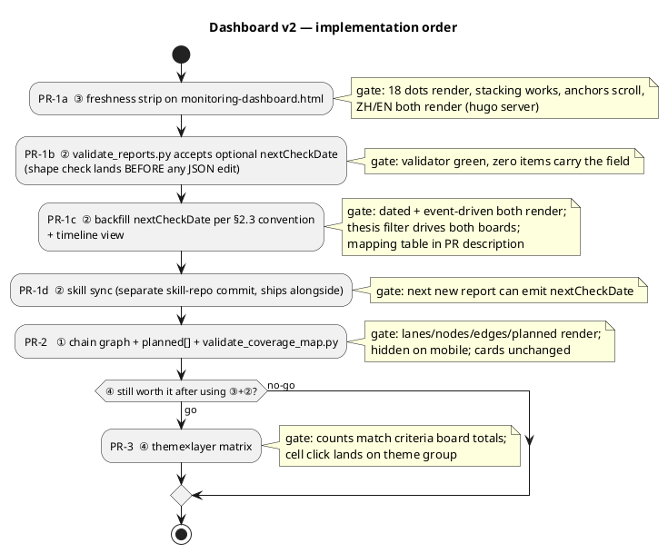

# Research Hub Dashboard v2 — Visualization Spec

**Status:** Ready to implement · **Owner:** (unassigned — handoff to implementing agent) · **Author:** planning session, 2026-07-02
**Depends on:** Phase 0 + monitoring dashboard, shipped at `34997b0` (spec: `docs/research-hub-enhancement-plan.md`).
**Scope of this doc:** four visualization workstreams, in priority order **③ freshness strip → ② next-check timeline → ① chain graph → ④ theme×layer matrix**. ④ is a go/no-go after ③+② ship.

This spec is **self-contained** — an implementing agent should not need the originating chat. The problem it attacks: the dashboard's three views and the coverage map are all *grouped lists* (rows, tables, cards). The Phase-0 data's most valuable content is **relational** (`chainLayer` structure, `related[]` cross-links, anchor/check pairing) and **temporal** (`priceAsOf` freshness, `nextCheck` cadence) — exactly what lists express worst. v2 renders those two dimensions as position and structure instead of stacked text.

---

## 0. Context & grounded facts (verified 2026-07-02)

| Fact | Value | Consequence |
|---|---|---|
| Current chain reports | 18, all pass `ENFORCE_CHAIN_ENRICHMENT` | every report has `stance` + `priceAsOf` + `reportedPeriod` + `monitoring[]` |
| `priceAsOf` range today | 2026-06-18 … 2026-07-01 (all 18 inside a 2-week window; several share a date) | ③ must stack same/near-date dots; axis must auto-scale as dates spread |
| `monitoring[]` items | 68 total, 3–5 per report | ② and ④ operate on 68 items |
| `theme` coverage | **68/68 items carry `theme`** (field stays optional in the validator) | ④ needs no "untagged" fallback today, but must still render one |
| `nextCheck` | free text, 56 distinct bilingual strings; mix of quarter-tied ("2026-Q2 财报"), fiscal-with-month ("FY2026-Q4 财报（约 2026-08）"), and pure event triggers ("融资公告", "232 决定") | ② needs a new structured field; event-driven items must stay first-class **without** a date |
| `related` | present on 15/18 reports; pairs are sometimes one-directional; 16 unique undirected edges after dedupe | ① draws deduped undirected edges |
| `coverage-map.json` | `layers` (10 ids, `foundry` empty & hidden), `roles`, `crossChecks`, `methodology` | ① reuses `layers` order; planned nodes need a new small array |
| Rendering stack | pure static HTML + vanilla JS, client-side fetch of `reports.json`/`coverage-map.json`, `localize()` + `PAGE_LABELS` for ZH/EN, theme CSS variables | all v2 visuals are hand-built inline SVG from the same data; **no charting libraries** |

Files touched (all under `static/invest/research/` unless noted):

| Workstream | Files |
|---|---|
| ③ freshness strip | `monitoring-dashboard.html` |
| ② next-check timeline | `monitoring-dashboard.html`, `data/reports.json` (backfill `nextCheckDate`), `validate_reports.py`, publishing skill (separate repo, see §2.4) |
| ① chain graph | `coverage-map.html`, `data/coverage-map.json` (optional `planned[]`), `validate_coverage_map.py` |
| ④ theme×layer matrix | `monitoring-dashboard.html` |

---

## 1. Locked decisions (do not re-litigate)

1. **Factual board carries over.** No status colors, no red/amber/green, no buy/sell language — inherited from v1 locked decision #3. v2 encodes facts as **position, structure, and density**, never as judgment color. A stance is shown as its existing neutral chip; it is never color-mapped.
2. **Order ③→②→①→④.** ③ is zero-schema and lands first; ② carries the **only `reports.json` schema change** (`nextCheckDate`, optional); ① is a separate page/PR; ④ is optional, decided after ③+② are live.
3. **Delivery slicing: three PRs.** PR-1 = ③+② (`monitoring-dashboard.html` + schema/backfill). PR-2 = ① (`coverage-map.html`). PR-3 = ④ (only if go). Each PR independently shippable and gated by the validators + `hugo --minify`.
4. **`nextCheckDate` is optional forever.** Event-driven monitoring items legitimately have no date. There is **no** gate flip for this field; never invent a date to fill it (see §2.3 convention).
5. **Hand-built SVG, no dependencies.** 18 nodes / 16 edges / 68 dots is trivial scale; all visuals are string-templated SVG rendered client-side, re-rendered on language switch (builders must be pure functions of `state` + `currentLang`).

---

## 2. Workstream ③ + ② — dashboard temporal views (PR-1)

### 2.1 ③ Freshness dot strip

A horizontal time strip answering "which reports' market data is oldest" at a glance. Position **is** the fact — no age-bucket coloring.

- **Placement:** `monitoring-dashboard.html`, inside the Verdict Board section, between the section header and `#verdictStack`.
- **Data:** each current chain report's `priceAsOf` (all 18 guaranteed present, `YYYY-MM-DD`).
- **Axis:** x = calendar time, from `min(priceAsOf) − 14d` to **today**; month gridlines + labels; a dashed vertical "今天 / today" marker at the right edge. Axis auto-scales — today all 18 dots sit in a 2-week cluster; the strip earns its keep as reruns spread out.
- **Dots:** one per report, all the same neutral color (`var(--secondary)`-toned fill or the existing chip treatment). Same-date / near-date dots **stack vertically** (fixed 12–14px offsets, beeswarm-lite); cap the SVG height at the tallest stack.
- **Interaction:** dot `title` tooltip = `company · ticker · priceAsOf`; click scrolls to that report's verdict row. Add anchors `id="verdict-{report.id}"` to the rows rendered by `renderVerdictRow()`.
- **i18n:** new `PAGE_LABELS` keys in both languages (strip caption, "today" label, month formatting). Month labels: `2026-06` style is acceptable in both languages (avoids month-name localization).
- **No schema change. No validator change.**

### 2.2 ② Next-check timeline

A quarter/month timeline answering "what should we be checking, and when" — turns the dashboard from an archive into a working calendar. This is the payoff view of PR-1.

- **Placement:** new section between the Verdict Board and the Kill-Criteria Board (it is the temporal index into the criteria board).
- **Data:** all 68 `monitoring[]` items across current chain reports, split into:
  - **dated** — items with the new optional `nextCheckDate` (`YYYY-MM`): rendered as dots in month buckets along the x axis;
  - **undated (event-driven)** — items without it: rendered as a single neutral chip beside the axis, e.g. "事件驱动 · N 项 / Event-driven · N items", linking (scroll) to the criteria board.
- **Axis:** months from `min(min(nextCheckDate), current month)` to `max(max(nextCheckDate), current month)` — both ends clamp to the current month so the "本月 / this month" marker always sits inside the axis (e.g. when every dated check is already past). Months **earlier than the current month are still rendered** (an overdue read is a fact worth seeing), left of the marker.
- **Dots:** stacked per month bucket, one per item, neutral color; count label above each bucket. Dot `title` = `company · metric` (localized). Click scrolls to the item's row in the criteria board — add anchors `id="crit-{report.id}-{item.id}"` on criteria rows (report-id + item-id is unique; item `id` alone is only unique per report).
- **Thesis filter:** the timeline **reuses the existing `state.thesisFilter`** (the bull/bear/either control) so the two views stay consistent; re-render the timeline when the filter changes.

### 2.3 ② Schema change — `monitoring[].nextCheckDate` (the only one)

```jsonc
{
  "id": "solvency-gpu-life-stress",
  // ...existing item fields unchanged; nextCheck stays the human-readable bilingual text...
  "nextCheck": "2026-Q2 财报 / Q2 earnings",
  "nextCheckDate": "2026-08"        // NEW, OPTIONAL: calendar month the next read is expected
}
```

- Format: `YYYY-MM` **only** (month granularity; no `-DD`). Validator regex: `^\d{4}-(0[1-9]|1[0-2])$`.
- `nextCheck` (free text) remains required and remains the displayed string; `nextCheckDate` exists **only** to position items on the timeline.
- **Backfill convention — deterministic, extraction not invention.** Apply top-down; if no rule matches, **omit the field**:

| Existing `nextCheck` pattern | `nextCheckDate` |
|---|---|
| carries an explicit month, e.g. "（约 2026-08）", "2026-08 投产确认" | that month |
| any string anchored to a specific **calendar** quarter `YYYY-Qn` (not `FY`-prefixed — fiscal quarters are the row below) — earnings **or** quarter-tied disclosures/reads ("2026-Q2 财报", "2026-Q2 集中度披露", "2026-Q2 backlog 转化披露", "2026-Q2 剔除重估经营利润"; these arrive with that quarter's print). Ranges "2026-Q2/Q3" → use the earlier Qn | Qn end-month + 2: Q1→`2026-05`, Q2→`2026-08`, Q3→`2026-11`, Q4→`2027-02` |
| "半年报 / H1 report" (CN/HK/EU reporters) | `2026-08` |
| fiscal-quarter strings **without** a parenthetical month; windows wider than a quarter ("2026-H2"); "年末披露" | omit |
| pure event triggers (融资公告 / 232 决定 / LOI→合同 / NRC 里程碑 / 客户公告 / 出口管制动态 …) | omit |

  Same-report sibling rule: when one monitoring item has already established a
  deterministic month for the same filing event (for example, another
  `FY2026-Q4` item in that report carries `（约 2026-08）`), sibling monitoring
  items tied to that exact filing may reuse the same `nextCheckDate`. This is
  still extraction from the report-level event, not an invitation to infer dates
  across reports or unrelated fiscal periods.

  Expected outcome: most earnings-tied items get a month; event-driven items stay undated. **Both states are first-class** — do not force a date to make the chart fuller. In the PR, list each item's mapping so the reviewer can spot-check against the rules above.
- **Validator (`validate_reports.py`):** in `validate_monitoring()`, add — `nextCheckDate` (if present) matches the regex. Nothing becomes required; no gate flip. Land the validator change in the same PR **before** the backfill commit so every JSON edit is shape-checked.

### 2.4 ② Skill sync (separate skill-repo change, ships alongside PR-1)

Same delivery pattern as v1 A.6 — the `company-research-publishing` skill lives outside this repo at `/Users/kyx/.codex/skills/company-research-publishing/` (`~/.claude/skills/company-research-publishing` is a symlink to it). A hub PR cannot carry it; land as a separate commit in the skill repo:

- `assets/templates/reports-json-entry.json` — add `nextCheckDate` placeholder to the monitoring-item stub.
- `references/publishing-contract.md` — document the field, its format, and the §2.3 convention (including "omit for event-driven — never invent").

---

## 3. Workstream ① — chain graph on the coverage map (PR-2)

Turn the coverage map's overview from a card grid into an actual graph: layers as swimlanes, reports as nodes, `related[]` as edges, roadmap gaps as dashed placeholders. The existing card stack **stays** as the detail listing.

### 3.1 Page structure

- **New section** at the top of `coverage-map.html`, between the hero and the existing `#layerStack` section: heading "链条图谱 / Chain Graph" + one inline SVG.
- The existing layer-cards, cross-check, methodology, and other-coverage sections are **unchanged**. Note the intentional asymmetry this creates: the graph shows a `foundry` lane once TSM is planned, while the card stack below still hides empty layers (a planned name has no report to card-ify). The two rules live in **separate code paths** — do not unify them into one render helper.
- **Responsive rule:** hide the graph section under `max-width: 760px` (CSS only) — ten swimlanes don't read on a phone; the cards below remain the mobile experience.

### 3.2 Graph contract

- **Lanes:** one horizontal row per `coverage-map.json` layer, in `layers` order. A lane renders iff its layer has ≥1 chain report **or** ≥1 `planned[]` entry — this is the **graph's** rule only; the card stack keeps its existing report-only hide-empty-layer rule (see §3.1). `foundry` gains a lane once TSM is planned/covered. Lane label = localized `layer.title`.
- **Nodes:** current chain reports (`chainLayer` + `isCurrent !== false`), placed in their lane, ordered by ticker. Label = `ticker` (line 1) + localized short company name (line 2). Click → report page via the same `reportUrl()`+`lang` pattern the dashboard uses. `title` tooltip = `company · updated {lastUpdate}`.
- **Role encoding (structural, not judgment):** `risk-anchor` and `architecture-check` nodes get a distinct border treatment + small role chip under the label (reuse the roles' existing localized labels from `coverage-map.json.roles`). All other nodes share one neutral style. **`stance` is not encoded in the graph at all** (locked decision #1).
- **Edges:** union of all `related[]` pairs where **both ends are current chain reports**, deduped as undirected pairs (16 edges today). Neutral stroke; cubic curves between lane rows. The coreweave↔nebius edge may carry the "互为对照 / cross-check pair" styling (dashed) driven by the two ends' `chainRole` values — not hardcoded ids.
- **Planned nodes:** dashed, non-clickable boxes rendered from a new optional `coverage-map.json` array:

```jsonc
"planned": [
  { "ticker": "TSM",     "layer": "foundry",        "label": { "zh": "台积电（计划）",   "en": "TSMC (planned)" } },
  { "ticker": "MU",      "layer": "memory-storage", "label": { "zh": "美光（计划）",     "en": "Micron (planned)" } },
  { "ticker": "CEG/VST", "layer": "power",          "label": { "zh": "CEG/VST（计划）", "en": "CEG/VST (planned)" } }
]
```

  Seeds above come from the agreed coverage roadmap (TSM → CEG/VST → MU). Keep the array in sync manually when a planned name ships (its report entry appears; delete its `planned[]` row in the same PR).
- **Validator (`validate_coverage_map.py`) — PR-2 must update it, not just pass it:**
  - **JSON shape:** `planned` (if present) is an array; each entry has non-empty `ticker`, `layer` resolving to an existing layer id, bilingual `label` (zh+en both non-empty).
  - **Page wiring:** `validate_page_wiring()` currently pins the card stack's skip-empty-layers behavior as a **literal source-string check** (`'if (!layerReports.length) return "";'`, line ~144). The card stack is unchanged in PR-2, so that literal should keep passing — but if adding the graph touches that render function, update the pinned literal in the same commit; the check's *intent* (cards hide report-less layers) is the contract, not the exact string. Additionally, extend `validate_page_wiring()` with a wiring check for the new graph section (e.g. its container id `chainGraph` present in the HTML), so the graph can't silently disappear the way the fetch-path checks guard the data URLs.

### 3.3 Layout notes (keep it boring)

Fixed-size lanes (rows), nodes flow left-to-right, viewBox ≈ 760 wide, height = lanes × lane-height. No force layout, no dragging, no zoom. If two lanes' edge curves overlap, nudge control points — 16 edges is few enough to look fine with a single curve style.

---

## 4. Workstream ④ — theme × layer density matrix (PR-3, optional)

Go/no-go after PR-1 ships. Answers "where is the book's monitoring attention concentrated, and where are the blind spots".

- **Placement:** `monitoring-dashboard.html`, after the Kill-Criteria Board (it is an index into it).
- **Grid:** rows = the 9 `theme` enum values that have ≥1 item (plus one "未标注 / untagged" row iff any item lacks `theme` — none today, but the field is optional); columns = layers with ≥1 current chain report, in `coverage-map.json.layers` order. Cell = count of monitoring items with that theme in that layer.
- **Thesis filter:** the matrix **reuses `state.thesisFilter`** and re-renders when it changes — same consistency rationale as the timeline (§2.2). Counts therefore always equal what the criteria board shows under the same filter; the matrix is never a separately-filtered view.
- **Density encoding:** single-hue intensity via `color-mix` on the existing accent variable, 3 buckets (1 / 2–3 / 4+); empty cells blank. Count digit always rendered — the shade is a reading aid, not the datum. Single-hue density of a count is factual; this does **not** breach locked decision #1.
- **Interaction:** clicking a cell sets the criteria board to `groupMode = "theme"` and scrolls to that theme's group anchor (`id="crit-group-theme-{theme}"`; add matching `crit-group-report-{id}` anchors for symmetry). **No layer filter is added to the criteria board** — locked, to keep scope flat; the cell click lands on the theme group and the reader scans within it.
- **Responsive:** wrap in `overflow-x: auto` under 760px.
- **No schema change. No validator change.** (68/68 items already carry `theme`.)

---

## 5. Implementation order (gates)



---

## 6. Acceptance criteria (definition of done)

**PR-1 (③+②)**
- [ ] Freshness strip renders all 18 chain reports; same-date dots stack; today-marker and month gridlines correct; dot click scrolls to the verdict row; ZH/EN both verified.
- [ ] `validate_reports.py` accepts `nextCheckDate` (`YYYY-MM` regex), rejects malformed values, and requires nothing new; validator commit precedes the backfill commit.
- [ ] Backfill follows the §2.3 table exactly; PR description lists every item's mapping; no invented dates (event-driven items left undated).
- [ ] Timeline renders dated items in month buckets (including overdue months) and the event-driven count chip; dot click scrolls to the criteria row; the existing thesis filter drives both the timeline and the criteria board.
- [ ] Skill repo carries the template + contract update (separate commit, ships alongside).

**PR-2 (①)**
- [ ] Graph renders every current chain report as a node in its layer lane; all 16 deduped `related` edges draw (count recomputed from data at implementation time); anchor/check pair styling is driven by `chainRole`, not ids.
- [ ] `planned[]` entries render dashed and non-clickable; lanes without reports **or** planned entries stay hidden in the graph; the card stack still hides report-less layers (including planned-only ones — intentional asymmetry, §3.1).
- [ ] `validate_coverage_map.py` updated per §3.2: `planned[]` shape checks + graph wiring check added; the empty-layer literal check still matches the actual page source (re-pinned if the line moved); validator green.
- [ ] Graph hidden under 760px; existing card stack, cross-check, methodology sections byte-identical in behavior.

**PR-3 (④, if go)**
- [ ] Matrix cell counts equal the criteria board's per-theme/per-layer item counts **under the same thesis filter**, and both re-render together when the filter changes; single-hue density only; cell click sets group-by-theme and scrolls to the group.

**All PRs**
- [ ] In-repo validators `validate_reports.py` and `validate_coverage_map.py` green (`check_research_package.py` lives in the publishing-skill repo, not here — it gates report packages, not these UI PRs, and is out of band); `hugo --minify` builds clean (pre-existing layout/`languageCode` warnings acceptable); every new label exists in both `PAGE_LABELS.zh` and `.en`; language switch re-renders every new SVG.

---

## 7. Out of scope (unchanged from v1 §6 unless listed)

- **List-page UX** (search, chain filters, verdict/freshness chips on cards) — still a separate fast-follow.
- **Layer filter on the criteria board** (see §4 locked interaction).
- **Any status/traffic-light rendering, stance color-mapping, or derived "signals".**
- **Charting/graph libraries, build steps, or bundlers.**
- **Freshness tooling** (refresh-queue CLI, rerun cadence doc) — ③ visualizes staleness; acting on it stays manual.
- **Content coverage** (TSM / CEG-VST / MU reports themselves — ① only renders them as planned placeholders).

## 8. Watch-outs for the implementer

- **Never invent `nextCheckDate`.** The §2.3 table is the whole convention; anything not derivable from the existing `nextCheck` text stays undated. Reviewer spot-checks the PR's mapping list against report prose.
- **`reports.json` is written by multiple agents/the publishing skill** — the skill-repo sync (§2.4) must ship alongside PR-1 or new reports silently omit `nextCheckDate` (soft failure: they just miss the timeline; the validator won't catch it because the field is optional).
- **`validate_coverage_map.py` pins page-source literals.** Its `validate_page_wiring()` greps `coverage-map.html` for exact code strings (fetch paths + the skip-empty-layers line). Any PR-2 refactor near those lines must re-pin the literals in the same commit, and the graph section gets its own wiring check (§3.2) — otherwise the validator and the new behavior drift apart.
- **Dedupe `related` edges as undirected pairs** — several are one-directional in the data (e.g. nebius→nvidia without the reverse); drawing both directions doubles ~half the edges.
- **Dense date clusters are the normal case today** (all 18 `priceAsOf` within two weeks; many items map to `2026-08`). Stacking must be correct at n≈12 in one bucket, not just n≈3.
- **Keep every new visual factual** — if a design choice starts encoding "good/bad" (color by stance, red overdue markers), stop; render position/structure/density only. Overdue timeline months use the same neutral dot color, distinguished by position alone.
- **Language switch re-renders the whole page** (`renderPage()`), so SVG builders must not cache DOM or read stale labels; follow the existing pure-render pattern in `monitoring-dashboard.html`.
