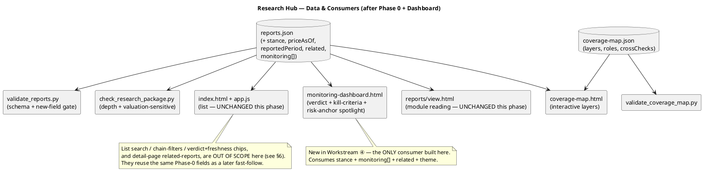
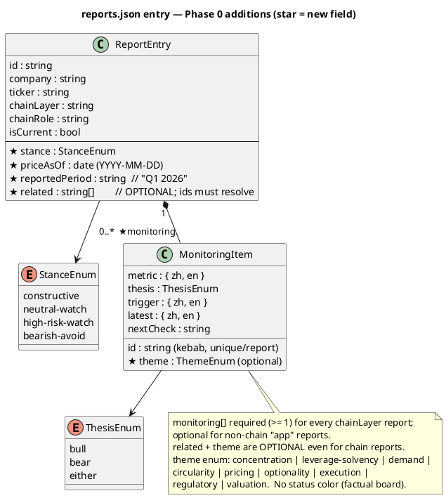
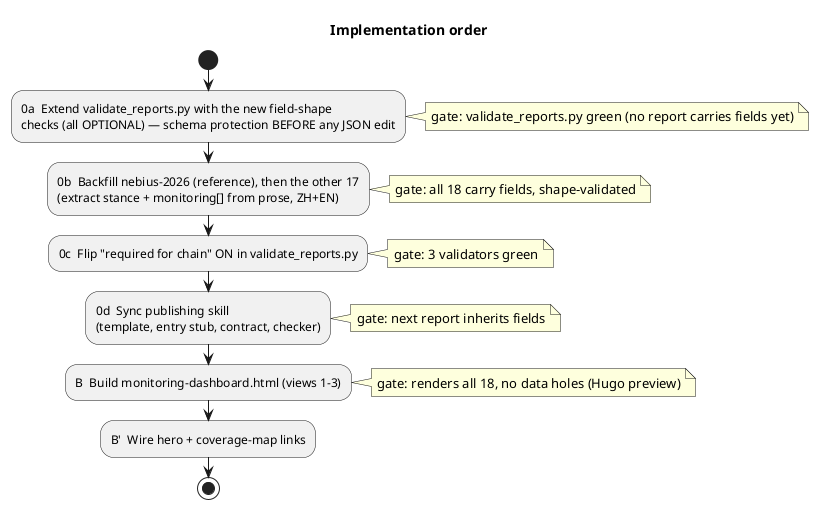
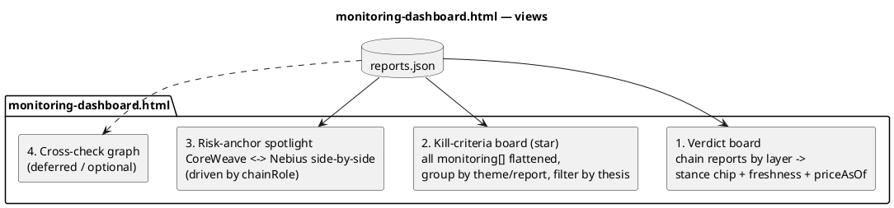

# Research Hub Enhancement — Implementation Spec

**Status:** Ready to implement · **Owner:** (unassigned — handoff to implementing agent) · **Author:** planning session, 2026-07-02
**Scope of this doc:** Phase 0 (structured-field groundwork) + Workstream ④ (book-level monitoring dashboard). Other workstreams are listed under [Out of scope](#out-of-scope) for context only.

This spec is **self-contained** — an implementing agent should not need the originating chat. It describes exact files, schema, validator rules, a backfill task with worked examples, the new dashboard page, PlantUML diagrams, and acceptance gates.

---

## 0. Context & current state (grounded)

The research hub lives at `static/invest/research/` in this Hugo repo and publishes bilingual (ZH/EN) company/ETF research reports organized as a deliberate **AI-infrastructure value chain**.

Current building blocks:

| File | Role | Relevant limitation today |
|---|---|---|
| `data/reports.json` | Single source of truth: one entry per report (metadata + `chainLayer`/`chainRole`) | No structured verdict, freshness, cross-links, or monitoring data |
| `index.html` + `app.js` | Report **list** page | Filter is **category-only** (4 hardcoded buckets); no search, no chain filters, no verdict/freshness chips |
| `reports/view.html` | Report **detail** page | Good: module reading, `?module=`, module-level `diff`, `?view=full`, `previousAnnualReport`. No "related reports" |
| `coverage-map.html` + `data/coverage-map.json` | AI-infra chain map (layers, roles, cross-checks) | Renders from `reports.json.chainLayer/chainRole`; cross-checks are static prose, not live |
| `reviews/` | Semi-annual review (`2026H1_复盘`) | Manually authored |
| `validate_reports.py` | Schema/reference gate for `reports.json` | Doesn't know the new fields yet |
| `validate_coverage_map.py` | Coverage-map wiring gate | — |
| `check_research_package.py` (in the `company-research-publishing` skill) | Report shape + depth + valuation-sensitivity gate | Doesn't know the new fields yet |

**Current coverage:** 28 current reports (+9 archived). 18 carry a `chainLayer` (the AI-infra "book"); 10 are non-chain "app" reports (AMZN/CRM/IGV/TEM/HIMS/COIN/NFLX/SPOT/ABNB/PYPL).

**The problem this spec attacks:** (a) reports carry point-in-time prices/multiples that silently go stale with no signal; (b) each report's verdict and kill-criteria are locked in prose, so there is no cross-report ("book-level") view of *what would change our mind and what the current read is* — even though the whole hub is built around a chain + risk-anchor framing (CoreWeave = risk anchor, Nebius = its cross-check).

---

## 1. Locked decisions (do not re-litigate)

1. **Phase 0 first**, then the dashboard. Phase 0's schema is designed to power the dashboard.
2. **Dashboard built to full** (views 1–3; view 4 deferred).
3. **Factual board — no status color.** The kill-criteria board shows metric · thesis · trigger · latest reading · next-check. **No** red/amber/green judgment field. (Rationale: the review process deliberately keeps the hub factual/dated rather than signal-like.)
4. **`monitoring[]` is hard-required for every `chainLayer` report**; optional for non-chain "app" reports.

---

## 2. Part A — Phase 0: structured-field groundwork

### A.1 New fields on each `reports.json` entry

For **`chainLayer`-tagged current reports**, four are **required** — `stance`, `priceAsOf`, `reportedPeriod`, and a non-empty `monitoring[]`. **`related` is optional** (add it only where a clear peer report exists), and `theme` on each monitoring item is also optional. For non-chain/app reports, only `stance` + `priceAsOf` are expected; `monitoring[]`/`related` are optional. Archived reports (`isCurrent: false`) are exempt.

```jsonc
{
  // ...existing fields (id, company, ticker, title, ... chainLayer, chainRole)...

  "stance": "high-risk-watch",        // enum, see A.3
  "priceAsOf": "2026-07-01",          // YYYY-MM-DD; the market-data snapshot date the report's price/mktcap/multiples reflect
  "reportedPeriod": "Q1 2026",        // the latest fiscal period the report reflects (free text, but use "Qn YYYY" / "FY YYYY")
  "related": ["coreweave-2026", "nvidia-2026"],   // OPTIONAL even for chain reports; report ids; must resolve to existing entries

  "monitoring": [                     // >= 1 item required for chainLayer reports
    {
      "id": "concentration-convergence",          // kebab-case, unique within the report
      "metric":  { "zh": "集中度收敛", "en": "Concentration convergence" },
      "thesis":  "bear",                            // enum: "bull" | "bear" | "either"
      "theme":   "concentration",                   // OPTIONAL enum (see Notes) — the ONLY key for the dashboard "by theme" view
      "trigger": { "zh": "微软+Meta 占比向 CRWV >60% 靠拢",
                   "en": "MSFT+Meta share climbs toward CoreWeave's >60% single-customer profile" },
      "latest":  { "zh": "两大合同约 $460 亿，2027 放量",
                   "en": "~$46B Microsoft+Meta commitments ramping into 2027" },
      "nextCheck": "2026-Q2"                        // when we expect the next read (free text; "Qn YYYY" or an event)
    }
  ]
}
```

**Notes**
- `metric`/`trigger`/`latest` are bilingual objects `{zh, en}` — both languages required (mirrors the report's ZH/EN parity rule).
- No `status` color field (locked decision #3).
- Keep `monitoring[]` small and high-signal: **3–5 items per report** (these are the thesis-breakers, not a metric dump).
- `theme` (optional, per item) is the **only** grouping key for the dashboard's "by theme" view — enum: `concentration | leverage-solvency | demand | circularity | pricing | optionality | execution | regulatory | valuation`. If an item omits `theme`, the dashboard groups it under its report; it must **not** infer theme from `id`/text.

### A.2 `stance` enum + mapping

Enum (4 values, ordered most→least constructive):

| `stance` | Meaning | Example reports |
|---|---|---|
| `constructive` | Net-positive risk/reward at current price | (none yet — most of the book is "watch") |
| `neutral-watch` | High-quality but fully/So priced; monitor | nvidia-2026, broadcom-2026, arista-2026, vertiv-2026, corning-2026, gevernova-2026, amd-2026, sk-hynix-2026, sandisk-2026 |
| `high-risk-watch` | Real upside but extreme valuation/execution/leverage risk | **nebius-2026**, aaoi-2026, bloom-energy-2026, oklo-2026, jinpan-2026, neov-2026, almonty-2026 |
| `bearish-avoid` | Bear-leaning / avoid-to-watch | **coreweave-2026** |

> The table above is the *starting* mapping. The implementer must **confirm each report's stance from its own §Conclusion verdict** (do not guess). `copx-2026` (ETF) and the 10 app reports: derive from their conclusions; several are `neutral-watch`. Add `stanceLabel`/`stanceLabelEn` only if a human-readable chip label is needed beyond the enum (optional; the UI can map enum→label).

### A.3 `monitoring[]` — two worked examples (extraction, not invention)

These already exist as prose in each report's §7 (Key Uncertainties / kill-criteria). The task is to **structure the existing prose**, not create new claims.

**`coreweave-2026` (risk anchor — its 4 kill-criteria):**

```jsonc
"monitoring": [
  { "id": "real-demand-vs-financing", "thesis": "bear", "theme": "demand",
    "metric":  {"zh":"真实需求 vs 融资","en":"Real demand vs financing"},
    "trigger": {"zh":"确认收入持续落后 backlog，且大比例订单由供应商兜底/单一客户","en":"recognized revenue keeps lagging backlog; large share of bookings supplier-backstopped/single-customer"},
    "latest":  {"zh":"RPO $994 亿 vs 约 $21 亿/季确认；NVIDIA $63 亿产能兜底","en":"RPO $99.4B vs ~$2.1B/qtr recognized; NVIDIA $6.3B capacity backstop"},
    "nextCheck": "2026-Q2" },
  { "id": "revenue-quality-circularity", "thesis": "bear", "theme": "circularity",
    "metric":  {"zh":"收入质量/循环性","en":"Revenue quality / circularity"},
    "trigger": {"zh":"前二客户维持 >2/3 收入，NVIDIA 仍是合约化需求兜底","en":"top-2 customers stay >~2/3 of revenue; NVIDIA remains a contracted demand backstop"},
    "latest":  {"zh":"微软历史 >60%；NVIDIA 供应商+股东+兜底","en":"Microsoft historically >60%; NVIDIA supplier+shareholder+backstop"},
    "nextCheck": "concentration % / related-party disclosures" },
  { "id": "solvency-gpu-life-stress", "thesis": "bear", "theme": "leverage-solvency",
    "metric":  {"zh":"GPU 寿命压力下的偿付","en":"Solvency under GPU-life stress"},
    "trigger": {"zh":"24 个月债务+租赁义务 > 合约+流动性（按 GPU 寿命=3 年压力）","en":"24-mo debt-service + lease/purchase commitments exceed contracted+liquid under a 'GPU life = 3 years' stress"},
    "latest":  {"zh":"约 $249 亿债务；Q1 利息年化约 $21 亿","en":"~$24.9B debt; Q1 interest annualizes to ~$2.1B"},
    "nextCheck": "maturities / interest coverage / depreciation policy" },
  { "id": "self-build-pricing-crack", "thesis": "bear", "theme": "pricing",
    "metric":  {"zh":"自建/定价开裂","en":"Self-build / pricing crack"},
    "trigger": {"zh":"某头部客户公开削减承诺，或 GPU 租金 ASP 随利用率下滑","en":"a top customer publicly cuts commitment, or GPU rental ASPs fall with slipping utilization"},
    "latest":  {"zh":"微软自建 MAI；OpenAI 分散至 Stargate/Oracle/Broadcom","en":"Microsoft MAI self-build; OpenAI diversifying to Stargate/Oracle/Broadcom"},
    "nextCheck": "Microsoft/OpenAI capacity commentary; rental ASP & utilization" }
]
```

**`nebius-2026` (architecture check — its 5 cross-checks):**

```jsonc
"monitoring": [
  { "id": "model-vs-balance-sheet", "thesis": "either", "theme": "demand",
    "metric":  {"zh":"模式 vs 资产负债表（核心交叉校验）","en":"Model vs balance sheet (core cross-check)"},
    "trigger": {"zh":"Nebius(净现金)与 CoreWeave(高杠杆)是否都在高利用率下持续转化 ARR","en":"do both Nebius (net cash) and CoreWeave (levered) keep converting ARR at high utilization"},
    "latest":  {"zh":"Nebius 经营现金流转正、ARR $19.2 亿放量","en":"Nebius OCF positive, ARR $1.92B ramping"},
    "nextCheck": "2026-Q2" },
  { "id": "concentration-convergence", "thesis": "bear", "theme": "concentration",
    "metric":  {"zh":"集中度收敛","en":"Concentration convergence"},
    "trigger": {"zh":"微软+Meta 占比向 CRWV >60% 靠拢","en":"MSFT+Meta share climbs toward CoreWeave's >60%"},
    "latest":  {"zh":"两大合同约 $460 亿，2027 放量","en":"~$46B two-contract ramp into 2027"},
    "nextCheck": "2026-Q2" },
  { "id": "earnings-quality-ex-marks", "thesis": "bear", "theme": "valuation",
    "metric":  {"zh":"盈利质量（剔除重估）","en":"Earnings quality (ex-marks)"},
    "trigger": {"zh":"利润持续依赖非现金投资重估而非经营","en":"profit stays driven by non-cash investment marks, not operations"},
    "latest":  {"zh":"Q1 净利 $6.21 亿 = $7.806 亿 ClickHouse 重估盖过 −$1.28 亿经营亏损","en":"Q1 net income $621M = $780.6M ClickHouse mark over a −$128M operating loss"},
    "nextCheck": "2026-Q2 operating income ex-marks" },
  { "id": "funding-durability", "thesis": "bear", "theme": "leverage-solvency",
    "metric":  {"zh":"融资可持续性","en":"Funding durability"},
    "trigger": {"zh":"'>90% 已锁定'的 2026 资本开支在更紧市场中失效","en":"the '>90% secured' 2026 capex claim breaks in a tighter market"},
    "latest":  {"zh":">90% 已由现金/合同锁定；$93 亿现金；预期 ABS","en":">90% secured by cash/contract; $9.3B cash; ABS expected"},
    "nextCheck": "ABS issuance vs Microsoft/Meta; ATM usage" },
  { "id": "optionality-crystallization", "thesis": "bull", "theme": "optionality",
    "metric":  {"zh":"期权兑现","en":"Optionality crystallization"},
    "trigger": {"zh":"Toloka/Avride/TripleTen/ClickHouse 被变现","en":"Toloka/Avride/TripleTen/ClickHouse get monetized"},
    "latest":  {"zh":"ClickHouse 重估 +$7.806 亿","en":"ClickHouse marked +$780.6M"},
    "nextCheck": "partner / stake-sale announcements" }
]
```

### A.4 Validator changes — `static/invest/research/validate_reports.py`

Extend the existing per-report validation (keep all current checks). Add:

- `stance` (if present) ∈ `{constructive, neutral-watch, high-risk-watch, bearish-avoid}`.
- `priceAsOf` (if present) parses as `YYYY-MM-DD`.
- `reportedPeriod` (if present) is a non-empty string.
- `related` (if present) is an array of strings, each resolving to an existing report `id` (reuse the existing `reports_by_id` map), and not equal to the report's own id.
- `monitoring` (if present) is an array; each item requires: `id` (kebab-case, unique within the report), `metric`/`trigger`/`latest` each an object with non-empty `zh` **and** `en`, `thesis` ∈ `{bull, bear, either}`, `nextCheck` non-empty string; `theme` (if present) ∈ `{concentration, leverage-solvency, demand, circularity, pricing, optionality, execution, regulatory, valuation}`.
- **Chain requirement:** if `chainLayer` is present and `isCurrent !== false`, then `stance`, `priceAsOf`, `reportedPeriod`, and a non-empty `monitoring[]` are **required**.
- **`related` and `theme` stay optional even for chain reports** — they are shape/resolution-checked when present, but never required by the chain gate.

> **Sequencing safety:** land the *field-shape* checks first (all optional), backfill all 18 chain reports, and only then flip on the **chain requirement** — so CI never goes red mid-migration (see A.7).

### A.5 Backfill task — the 18 chain reports

Extract `stance` + `priceAsOf` + `reportedPeriod` + `related` + `monitoring[]` for each, **from the report's existing prose** (§Conclusion verdict, §Key data price/date, §Key Uncertainties). Do **not** invent numbers; if a report lacks explicit kill-criteria, derive 3–5 from its bull/bear section. Keep ZH/EN aligned.

| chainLayer | reports (ids) |
|---|---|
| compute | `nvidia-2026`, `amd-2026` |
| custom-merchant-silicon | `broadcom-2026` |
| memory-storage | `sk-hynix-2026`, `sandisk-2026` |
| networking | `arista-2026` |
| optical | `aaoi-2026`, `corning-2026` |
| power | `gevernova-2026`, `bloom-energy-2026`, `oklo-2026`, `jinpan-2026`, `neov-2026` |
| datacenter-facility | `vertiv-2026` |
| resources | `copx-2026`, `almonty-2026` |
| demand-risk | `coreweave-2026`, `nebius-2026` |

`related` seeds (extend as sensible): `nebius-2026`↔`coreweave-2026`↔`nvidia-2026`; `arista-2026`↔`broadcom-2026`/`aaoi-2026`/`corning-2026`; `vertiv-2026`↔`gevernova-2026`/`bloom-energy-2026`; `sandisk-2026`↔`sk-hynix-2026`.

### A.6 Skill sync (so future reports keep the schema alive)

Update the `company-research-publishing` skill. **Canonical path on this machine:** `/Users/kyx/.codex/skills/company-research-publishing/` (with `~/.claude/skills/company-research-publishing` a symlink to it — edit via either path, they are the same files).

- `assets/templates/reports-json-entry.json` — add the new fields with placeholders (`stance`, `priceAsOf`, `reportedPeriod`, `related`, `monitoring[]`).
- `assets/templates/report.en.md` / `report.zh.md` — add a short "monitoring / kill-criteria" note so authors write them.
- `references/publishing-contract.md` — document the fields + the chain requirement.
- `scripts/check_research_package.py` — optional: warn if a `chainLayer` report is missing `monitoring[]` (belt-and-suspenders alongside `validate_reports.py`).

> **Delivery — this is a repo-external, machine-local change.** The skill lives *outside* this Hugo repo, so a normal hub branch/PR **cannot** carry it. Land A.6 as a **separate commit in the skill's own repo** (the Codex skill dir), tracked independently. Do **not** block the hub PR on it — but the two must ship together, or new reports silently omit the fields (see §7). The **enforcing gate that IS in-repo is `validate_reports.py`** (A.4); the skill edits only make authors *emit* the fields. If you want an in-repo safeguard beyond the validator, vendor a repo-local copy of the entry template under `static/invest/research/` and reference it from the skill.

### A.7 Migration order & gates

This is the **canonical order** (the PlantUML in §4.3 mirrors it). The validator's *shape* checks must land **before** any JSON is hand-edited, so every backfill edit is schema-protected:

1. **Extend `validate_reports.py` with the new field-shape checks, all OPTIONAL** (enum, formats, `monitoring[]` item keys incl. ZH+EN, `related`/`theme` resolution) — *no JSON touched yet*. → `validate_reports.py` green (no report carries the fields, so nothing fails).
2. Backfill `nebius-2026` first (reference), then the other 17 — now every edit is validated for shape + ZH/EN as you go. → each passes shape checks.
3. **Flip on the chain requirement** in `validate_reports.py`. → `validate_reports.py` + `check_research_package.py` + `validate_coverage_map.py` all green.
4. Skill sync (**separate skill-repo change; not carried by the hub branch — see A.6**). → next new report inherits the fields.

---

## 3. Part B — Workstream ④: book-level monitoring dashboard

### B.1 New page

`static/invest/research/monitoring-dashboard.html` — client-side, **same pattern as `coverage-map.html`** (fetch `reports.json`, render, no build step). Add nav links from `index.html` hero and from `coverage-map.html`.

### B.2 Views

1. **Verdict board** — every `chainLayer` report grouped by layer; each shows: company/ticker, `stance` chip (styled subtly — it is the report's *own* published verdict, not a new signal), computed **freshness**, `priceAsOf`, `reportedPeriod`, link to the report.
2. **Kill-criteria board** ⭐ (the payoff) — flatten every report's `monitoring[]` into one filterable list. Columns: report · metric · thesis (bull/bear/either) · trigger · latest reading · next-check. Grouping toggle: **by report** or **by theme** (grouped on each item's optional `theme` field — see the A.1 enum; items without `theme` fall back to their report group; **no** heuristic parsing of `id`/text). Filter by `thesis`. **No status color.**
3. **Risk-anchor spotlight** — `coreweave-2026` (risk-anchor) and `nebius-2026` (architecture-check) side-by-side, their `monitoring[]` aligned, because a change in that A/B re-rates the whole book. Drive this off `chainRole` (`risk-anchor`, `architecture-check`) so it generalizes if more anchors are added.
4. **Cross-check graph** *(deferred/optional)* — nodes = reports, edges = `related`. Only build if it doesn't balloon scope.

### B.3 Freshness computation (client-side, no stored state)

- `priceAgeDays = today − priceAsOf`. Buckets: **fresh** `< 30d`, **aging** `30–90d`, **stale** `> 90d`.
- `reportedPeriod` shown as-is; optionally compute "N quarters behind" vs the newest `reportedPeriod` in the dataset.
- Display as a small neutral badge (this is factual age, not a call to act).

### B.4 Wiring & B.5 Verify

- Link: `index.html` hero (next to the coverage-map link) + a tab/link on `coverage-map.html`.
- Verify (local Hugo preview): dashboard renders **all 18** chain reports in views 1–3 with **no data holes**; every `monitoring[]` item shows ZH and EN; freshness badges compute; links resolve. Re-run all three validators.

---

## 4. Diagrams (PlantUML)

> Render with any PlantUML tool (e.g. `plantuml file.md`, the PlantUML server, or an IDE plugin). GitHub does not render PlantUML inline; the source below is the source of truth.

### 4.1 Architecture — data & consumers (after Phase 0 + dashboard)



### 4.2 Schema — `reports.json` entry additions (★ = new)



### 4.3 Implementation order (gates in notes)



### 4.4 Dashboard views



---

## 5. Acceptance criteria (definition of done)

- [ ] All 18 `chainLayer` current reports carry `stance`, `priceAsOf`, `reportedPeriod`, and a 3–5 item `monitoring[]` (ZH+EN on every item), extracted from existing prose (no fabricated figures); `related` and `theme` added where they apply (both optional).
- [ ] `validate_reports.py` enforces the new fields + the chain requirement and passes.
- [ ] `validate_coverage_map.py` and `check_research_package.py` still pass.
- [ ] `monitoring-dashboard.html` renders views 1–3 for all 18 reports with no data holes; freshness computes; ZH/EN both shown; links resolve (verified in local `hugo server`).
- [ ] Links to the dashboard exist from the hero and the coverage map.
- [ ] The publishing skill emits the new fields for future reports (separate skill-repo change; ships alongside, not inside, the hub PR).
- [ ] `hugo --minify` builds clean (pre-existing layout/`languageCode` warnings are acceptable).

## 6. Out of scope (future workstreams, not this handoff) {#out-of-scope}

Captured for context; **do not** build here:

- **List-page UX** beyond what the dashboard needs: full-text search, chain-aware filters, verdict/freshness chips on cards (these reuse the Phase 0 fields — a fast follow, separately specced).
- **Content coverage:** filling `foundry` (TSM), then MU / CEG-VST / neocloud cohort (CORZ/APLD/IREN) / MRVL / PWR / ASML / COHR-LITE.
- **Freshness tooling:** a refresh-queue CLI wrapping the valuation-sensitive checker; a rerun cadence doc.
- **EN hub chrome** (`?lang` on the shell), RSS, link-checker, report scaffolding command.
- **Cross-check graph** (dashboard view 4) unless it stays trivial.

## 7. Watch-outs for the implementer

- **`reports.json` is written by multiple agents/the publishing skill.** Coordinate the schema change with A.6 or new reports will silently omit the fields.
- **Extraction, not invention.** Every `monitoring[].latest` and figure must trace to the report's existing text. If unsure, cite the report section you pulled it from in your PR.
- **Keep the board factual.** No status colors, no buy/sell language — this is a deliberate tone/compliance decision.
- **ZH/EN parity applies to the new fields too** — a monitoring item with only one language should fail review.
- **Sequence the gate flip** (A.7) so CI is never red mid-backfill.
